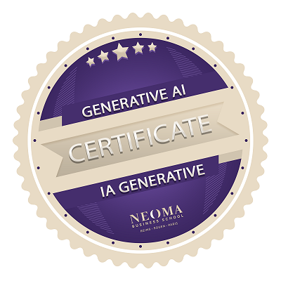

  

# 👋 Hi, I'm Clara Mayon !

## Web Data Analyst | Digital Marketing & Data

## ✨ About me
The way data can solve real-world strategic challenges fascinates me, which is why I chose to specialize in **Data Analytics** after completing a Master in Management with a specialization in **Marketing**.  
My hybrid background in digital marketing and data allows me to understand and bridge the gap between business objectives and technical data analysis.

## 📌 What I do currently
Currently a **Web Analytics Consultant** at **Converteo**, I work for **L'Oréal USA** on their web tracking strategy:

My missions include:
- Daily coordination with L'Oréal USA teams in New York from Paris, utilizing **Agile project management** methodologies
- **Design and QA of tagging plans** for 47 international websites
- Advanced **configuration of Google Tag Manager (Client-side & Server-side) and Google Analytics 4**
- **Performance monitoring** and proactive **resolution of data anomalies or inconsistencies** through in-depth GA4 investigations
- **Design of Google Looker Studio dashboards** dedicated to tracking health and performance monitoring

## 🛠️ Skills

* **Data Analysis**: Excel, SQL
* **Web Analytics**: Google Analytics (GA4), Google Tag Manager (GTM)
* **Data Visualization**: Looker Studio, Power BI
* **Business Tools**: SAP BusinessObjects, Qliksense
* **Languages**: French (Native), English (Professional), German (Limited)

<!--\n

## 📂 Data Portfolio

> *Currently building a collection of projects that demonstrate the full data lifecycle—from collection to insight.*

### 📊 End-to-End Analysis Projects
* **[Project Name 1]** - *Coming Soon*: A full-stack analysis using Python for cleaning, SQL for querying, and Power BI for storytelling.

### 🐍 Python & SQL Lab
* **SQL Case Studies**- *Coming Soon*: Complex joins and CTEs.
* **Python Automation**- *Coming Soon*: Scripts for cleaning messy marketing datasets and exploratory data analysis (EDA).

### 📈 Market & Business Insights
* **Market Trends Analysis**- *Coming Soon*: Leveraging my experience conducting 12+ market studies at Média-Participations to identify key commercial trends.\n-->

## 💼 Professional Background

* **2025-2026 : Web Analyst Consultant @ L'Oréal USA (via Converteo)** : collecting web data through GTM to provide commercial insights via GA4
* **2023-2025 : Market Analyst @ Média Diffusion**: transforming market data (GfK) into strategic recommendations for book publishers

## 🎓 Education & Certifications
* **2025-2026 : MS Digital Marketing & Data** – KEDGE Business School
* **2022-2025 : MiM, Brand Management and Services Marketing** – NEOMA Business School
* **Certifications**: Google Analytics (Google Skillshop GAIQ), Google Tag Manager Fundamentals (Analytics Mania), Generative AI (Neoma BS) 

<td align="center">
  
</td>
<td align="center">
  
</td>

## 📬 How to reach me
* **LinkedIn**: [linkedin.com/in/clara-mayon](https://www.linkedin.com/in/clara-mayon)
* **Email**: mayon.clara@gmail.com
